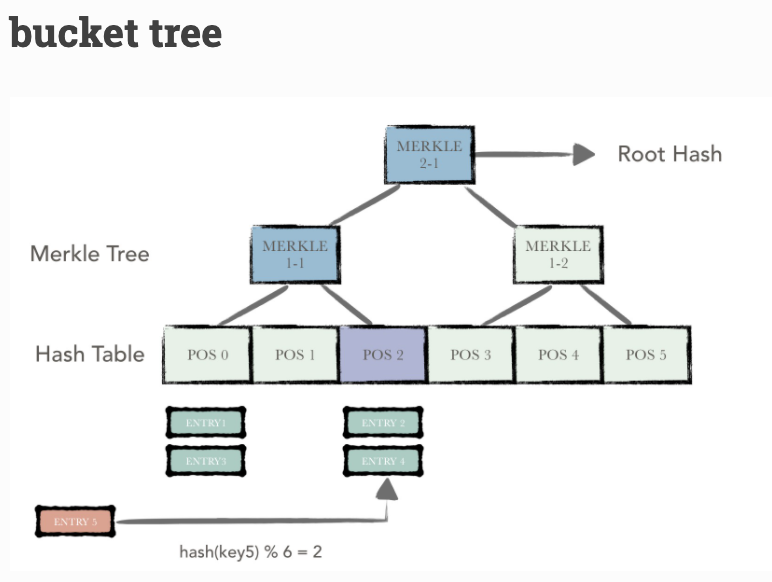
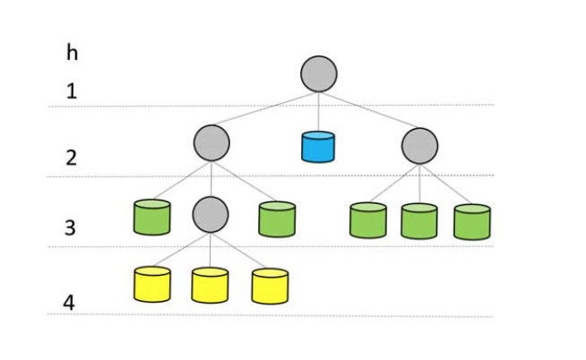
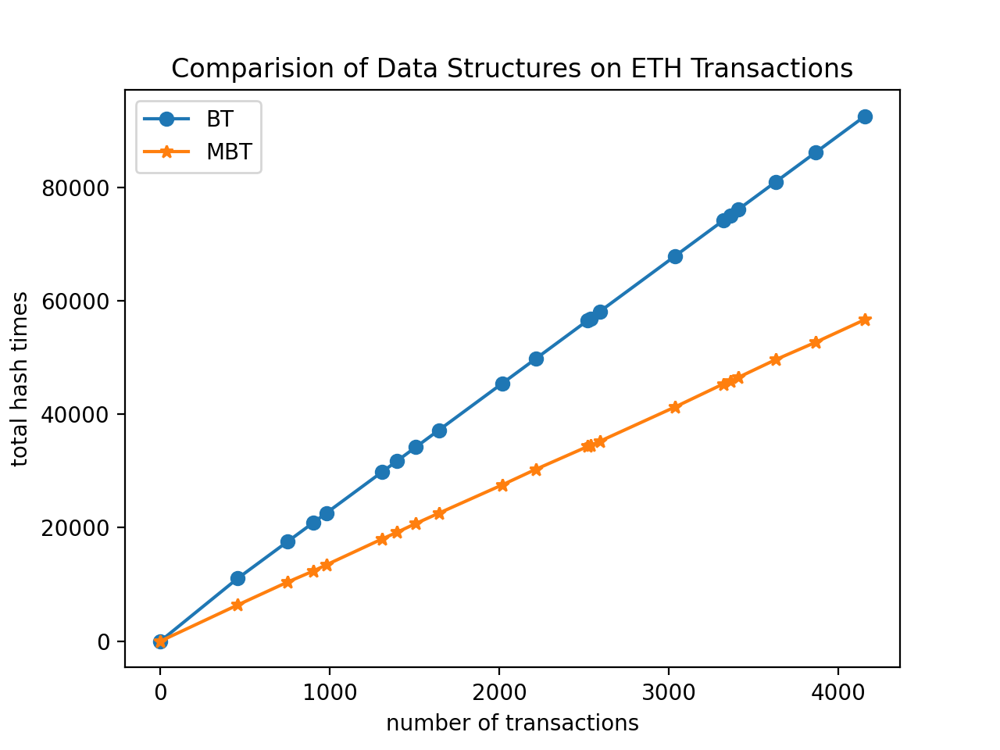

# Readme

---

## Project Structure

Overview of the project:

~~~bash
.
├── README.assets
├── README.md
├── code 
│   ├── bucket_tree.py
│   ├── data_analysis.py 
│   ├── evaluation.py
│   └── mod_bucket_tree.py
└── data
    ├── data
    │   ├── txs1.csv
		.   .
		.   .
		.   .
    │   └── txs9.csv
    └── raw_data
        ├── block12990972.txt
       	.
       	.
       	.
        └── block12990991.txt

5 directories, 51 files
~~~

The experiment consists 3 parts:

1. **Data analysis**: This part gives a brief investigation on the transaction pattern and account usage frequency from historical data from Ethereum
2. **Data structure design**: This part introduces the efficient data structure designed for reducing hash operations in maintaining blockchain data
3. **Evaluation**: This part compares the efficiency of different data structures on the historical transactions

**All codes for this experiment are written in Python**

~~~bash
python3 xxx.py # run the code
~~~

---

## Part I: data analysis

### Dataset

#### 1. Historical Raw Data

The data is collected directly from the historical raw block data of **Ethereum**, the most popular account-based blockchain, here are some features of the raw data:

1. Contains very much info you can get from continuous 20 blocks (from block number **12990982**  to **12990991**)
2. Blocks were mined between **08-09-2021 20:36:26** to  **08-09-2021 20:41:28** (East Pacific Time), relatively fresh
3. Raw blocks downloaded from [tokenview](https://tokenview.com/en/) api, in `json` format

Check out the raw data of the original blocks in `./data/raw_data/block#.txt`

#### 2. Pre-process 

Raw data converted to `.csv` format, much easier to understand

Check out the pre-processed dataset in `./data//data/txs#.csv`

### Block & Transaction Patterns

#### 1. Basic Statics

1. Block time: `~15`s per block, which is much quicker compared with Bitcoin or Litecoin
2. Average transactions per block: `~200` txs  per block
3. Other: Not a single fork detected,  because no uncle inclusion rewards are contained in those blocks

#### 2. Account usage frequency

1. In total, `4166` accounts engages in the `4157` transactions,  which suggests a single account takes part in `1` transactions on average
2. **`1%` of the most used accounts contributes to ` 32%` of total transactions, `5%` of the most used accounts contributes to ` 43%` of total transactions, and with `20%` of the most used accounts contributes to ` 75%` of total transactions**
3. Thus, we can draw a conclusion that only a relatively small amounts of accounts are used frequently in Ethereum, or we can also say that **account usage frequency is highly heterogeneous**

Check out code for this part in `./code/data_analysis.py`

---

## Part II: Data Structure Design

### Bucket Tree

A bucket tree is a combination of:

- merkle tree
- hash table

Actually, it is a normal merkle tree *stands on* a fixed sized hash table, which also called buckets.

For the merkle tree, if the number of tree nodes in this layer is oddr, then this case directly performs hashing on the last remaining tree node, and the hash of its parent node is the hash of its own hash (but don't need to do extra hash of itself).

For the hash table (buckets), it is used to maintain the original account data. In the experiment, I write down the account balance in entries, and several entries are hashed to a single bucket, so each bucket has a hash value (hashed to a leaf node) to represent the current state.

Similar to Bitcoin, the degree of aggregation of the merkle tree is `2` (binary tree) in the experiment.

The number of buckets is set to `512`

Check out code for this part in `./code/bucket_tree.py`

### Hierarchical Bucket Tree

I got the idea from the paper listed behind (*Efficient Blockchain-Based Software Systems via Hierarchical Bucket Tree*)

By analysis the account usage pattern, we can discover that a relatively small amount of accounts take up a large amount of the total transactions. Also, **we know for a merkle tee, when a leaf is closer to its root, the less hash will be done when updates.** So the principal is simple, we put the buckets of bucket tree at different heights.

The image above demonstrates a simple HBT, with three different types of  buckets at different height. The ideal solution is to put the more frequently used accounts in lower buckets (or h is smaller).

### Modified Bucket Tree

**However**, **my implementation is a bit different. My modified BT (MBT) is constructed with three different BTs, as its subtrees.** The smaller (with fewer leavers, or shorter) the BT is, the less buckets it got, so the less hashes will be done when update accounts. Thus we plan to put the more frequently used accounts in smaller subtree.

Parameters for three subtrees are set as:

>- `8` buckets for the smallest, holding the most heacily used accounts data (5%)
>- `16` buckets for the medium, holding the frequently used accounts data (20%)
>- `128` buckets for the largest, holding the rest

Check out code for this part in `./code/mod_bucket_tree.py`

---

## PART III: Evaluation

In this part, we will use our data structures to replay 20 blocks of transactions pulled from ETH.

### Assumption

- All data structures start from blank
- We only maintain the balance info for accounts to demonstrate, and each account is distributed 10 ETH in advance (anyway, it doesn't matter)
- We already know the accounts usage pattern concretely (e.g. which account happened to be the most active ones)
- Tree parameters set as PART II

### Result

The figure above shows that times of hash done in MBT is a lot fewer than in BT. Approximately, `40%`of hash operations are reduced in our new data structure.

Check out code for this part in `./code/evaluation.py`

---

## Conclusion

The Modified Bucket Tree, with the similar principal with the HBT, works well on reducing hash operations for blockchain system.

In the future, we can propose a algorithm for the MBT to adapt the account usage pattern dynamically in order to optimize the efficiency. 

## References

1. [Hyperchain's documentation](https://hyperchain.readthedocs.io/en/latest/bucket_tree.html)
2. [Efficient Blockchain-Based Software Systems via Hierarchical Bucket Tree](https://dl.acm.org/doi/10.1145/3183440.3195009)

